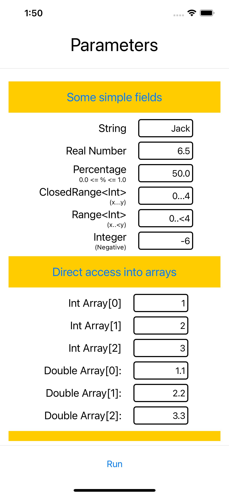

# SwiftUIFields

SwiftUIFields provides two customised views to assist in collecting typed and validated data in a user interface for both macOS and iOS apps. They are intended as more flexible substitutes for the less functional TextField() which handles only String values.

The Views are:

    Field(value: Binding,
          caption: String = "",
          subcaption: String = "",
          validator: FieldValidator? = nil) -> Field

and

    FieldsButton(values: Binding<[T]>,
                 caption: String = "",
                 subcaption: String = "",
                 imageName: String = "list.bullet.rectangle",
                 fieldValidator: FieldValidator<T>? = nil,
                 sheetValidator: SheetValidator<T>? = nil) -> FieldsButton

Most parameters have default values making usage very simple.

A Field() presents a "textfieldlike" control which can collect any datatype which conforms to FieldsProtocol with an optional caption, subcaption and validation closure.

A FieldsButton() presents a sheet of "textfieldlike" controls which can collect an array of any datatype which conforms to FieldsProtocol with an optional caption, subcaption, buttonimage and both field and collection-wide validation closures.

If invalid data is entered, or if data entry is abandoned (by transferring focus to another control) the value reverts to its original value and an error message appears below it if one is specified with the FieldValidator closure.

The FieldProtocol determines what types can be handled by a Field(). The requiredments are minimal: a failable initialised which takes a string which can be interpreted as the value and a method which converts a value to such a String. Extensions which make common types (Int, Double, Float, CGFloat, Range, Closed Range) conform are included in the Package. to FieldProtocol

    public protocol FieldProtocol {
        init?(_ string: String) // already conformed to by most types
        func stringified() -> String
    }

A FieldValidator is a struct which combines a closure with an error message:

    FieldValidator(validator: (T) -> Bool,
                   errorMessage: String) -> FieldValidator

The closure takes a value and returns true (valid) or false (invalid).
